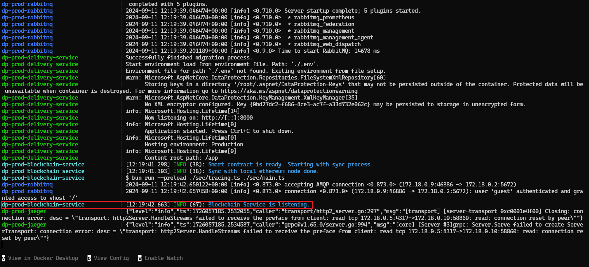

<p align="center">
  
</p>

Delivery Platform Demo is a pet project replicating package delivery services, focusing on tracking and managing packages via QR code scanning. It also records the entire delivery process on the Ethereum blockchain for package history.

<p align="center">
  
</p>

## Table of Contents

- [Key Features](#key-features)
- [Running the Project Locally](#running-the-project-locally)
  - [Prerequisites](#prerequisites)
  - [1. Start the Project](#1-start-the-project)
  - [2. Prepare the Initial Data](#2-prepare-the-initial-data)
  - [3. Try Out the App](#3-try-out-the-app)
- [Documentation](#documentation)
- [Contributors](#contributors)
- [Project Motivation & Goals](#project-motivation--goals)
- [License](#license)

## Key Features

- :truck: Couriers can scan QR codes on packages to manage delivery tasks, including accepting packages in the warehouse, starting delivery, and confirming delivery
- :pencil2: If the camera is unavailable, couriers can manually input package information
- :world_map: Customers can effortlessly track the real-time location of their packages
- :globe_with_meridians: The customer's UI reads package data directly from the Ethereum blockchain, ensuring transparency
- :lock: Package history is securely recorded on the Ethereum blockchain.
- :hammer_and_wrench: The platform uses Jaeger for distributed tracing across services

## Running the Project Locally

To try out the project and its features, you need to run it locally. Follow the steps below.

### Prerequisites

Ensure you have the following tools installed:

- [Docker](https://www.docker.com/)
- [Git Bash](https://git-scm.com/) (Windows only)

### 1. Start the Project

To start the project, run the following command:

```bash
docker compose -f docker-compose-full.yml --env-file ./.env.full-example up --build
```

> [!NOTE]
> The initial setup may take up to 5 minutes, depending on your PC. Some errors might appear during startup as services depend on each other and will restart until all are ready.

When the terminal displays the message `Blockchain Service is listening.`, the project is up and running. You can verify this by checking the screenshot below:



### 2. Prepare the Initial Data

Once the services are running, execute the following command to insert users and companies into the database:

```bash
./scripts/startup/setup-project.sh --env prod
```

### 3. Try Out the App

To explore example flow, follow the steps provided [here](./docs/example-flows/full-package-delivery-scenario.md).

- **Tracking UI:**
  - URL: [http://localhost:3000](http://localhost:3000)
- **Delivery UI:**
  - HTTP URL: [http://localhost:3001](http://localhost:3001)
  - HTTPS URL: [https://localhost:3002](https://localhost:3002)
- **Mailpit UI:**
  - URL: [http://localhost:8025](http://localhost:8025)
- **Delivery Service API:**
  - Base HTTP URL: [http://localhost:8000](http://localhost:8000)
  - Swagger HTTP URL: [http://localhost:8000/swagger](http://localhost:8000/swagger)
  - Base HTTPS URL: [https://localhost:8001](https://localhost:8001)
  - Swagger HTTPS URL: [https://localhost:8001/swagger](https://localhost:8001/swagger)
- **Local Ethereum Node (JSON-RPC)**:
  - Base URL: [http://localhost:8545](http://localhost:8545)
- **Jaeger UI:**
  - URL: [http://localhost:16686](http://localhost:16686)

## Documentation

If you'd like to explore the project's evolution or find additional information, you can browse through the documentation.

- [Setup Guides](./docs/setup-guides)
  - [How to Set Up Backend for Frontend Development](./docs/setup-guides/how-to-setup-backend-for-frontend-development.md)
- [Example Flows](./docs/example-flows)
  - [Full Package Delivery Scenario](./docs/example-flows/full-package-delivery-scenario.md)
  - [Distributed Tracing](./docs/example-flows/distributed-tracing.md)
- [Initial Architecture](./docs/initial-architecture)
  - [Architecture & Technologies](./docs/initial-architecture/architecture-and-technologies.md)
  - [User Flows](./docs/initial-architecture/user-flows.md)
  - [Designs](./docs/initial-architecture/designs.md)

## Contributors

<table>
  <tr>
    <th>Contributor</th>
    <th>Contributions</th> 
  </tr>
  <tr>
    <td>
      <a href="https://github.com/AljazOblonsek"><b>@AljazOblonsek</b></a>
    </td>
    <td>
      <ul>
        <li><a href="./services/delivery-service/">Delivery Service API</a></li>
        <li><a href="./services/blockchain-service/">Blockchain Service</a></li>
        <li><a href="./services/smart-contract/">Smart Contract</a></li>
        <li><a href="./services/delivery-ui/">Delivery UI</a></li>
        <li>Documentation</li>
      </ul>
    </td>
  </tr>
  <tr>
    <td>
      <a href="https://github.com/urosmeh"><b>@urosmeh</b></a>
    </td>
    <td>
      <ul>
        <li><a href="./services/tracking-ui/">Tracking UI</a></li>
        <li>Documentation</li>
      </ul>
    </td>
  </tr>
  <tr>
    <td>
      <a href="https://github.com/maticsusteric"><b>@maticsusteric</b></a>
    </td>
    <td>
      <ul>
        <li><a href="./services/delivery-ui/">Delivery UI</a></li>
        <li>Documentation</li>
        <li>Preview animation</li>
      </ul>
    </td>
  </tr>
</table>

## Project Motivation & Goals

This project aims to accomplish the following:

- Develop a straightforward package delivery system that records package history on the blockchain
- Demonstrate how blockchain can be used for applications beyond cryptocurrency
- Gain hands-on experience with new technologies

## License

This project is licensed under the MIT License. See the [license file](./LICENSE) for details.
