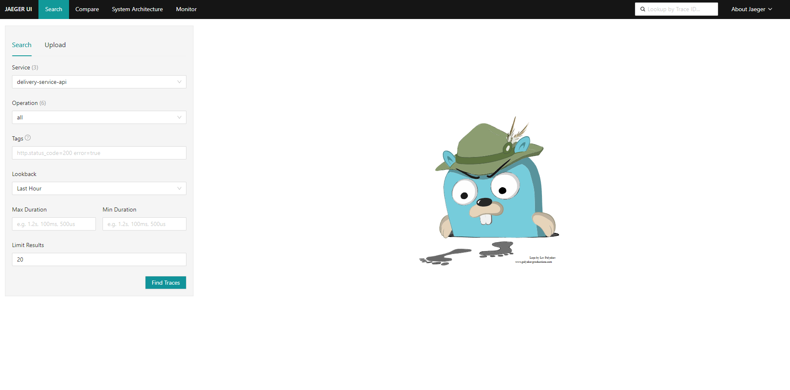
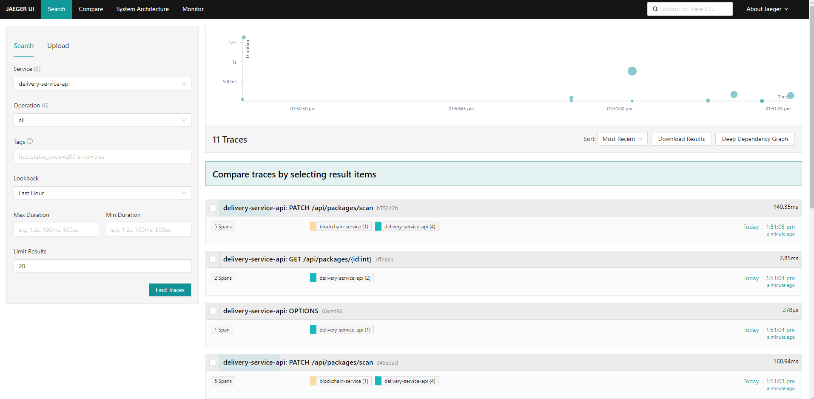
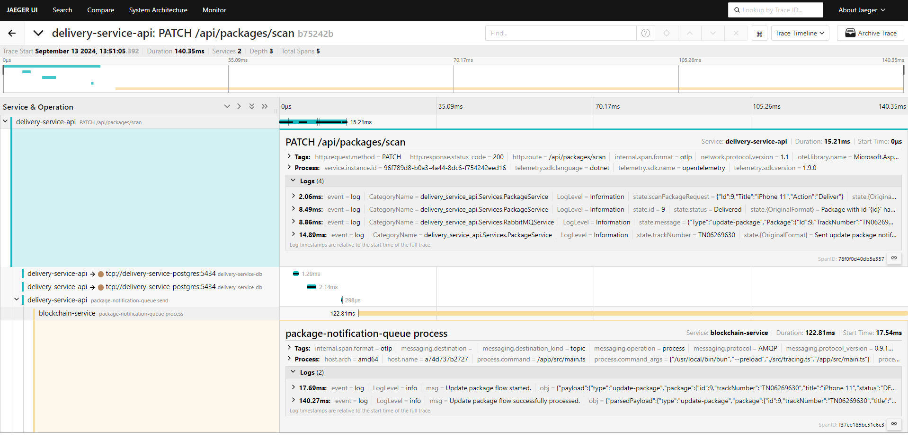

# Distributed Tracing

In our event-driven architecture, a single API call can trigger interactions across multiple services. To keep track of these distributed actions and make debugging easier, we use <a href="https://www.jaegertracing.io" target="_blank">Jaeger</a>, an open-source distributed tracing platform.

After following the [Full Package Delivery Scenario](./full-package-delivery-scenario.md), you should be ready to open the **Jaeger Dashboard** at <a href="http://localhost:16686" target="_blank">http://localhost:16686</a> to view traces.

## Table of Contents

- [Step 1: Open the UI](#step-1-open-the-ui)
- [Step 2: Search for `delivery-service-api` Traces](#step-2-search-for-delivery-service-api-traces)
- [Step 3: Examine a Specific Trace in Detail](#step-3-examine-a-specific-trace-in-detail)

## Navigating the Jaeger UI

### Step 1: Open the UI

Start by opening the Jaeger Dashboard, which runs at <a href="http://localhost:16686" target="_blank">http://localhost:16686</a>. On the left-hand side, you’ll see a search bar where you can search for traces of specific services.

  

### Step 2: Search for `delivery-service-api` Traces

In the search menu, select `delivery-service-api` from the dropdown list, then click the `Find Traces` button. This will display a list of all requests made to this API.

  

### Step 3: Examine a Specific Trace in Detail

To explore a specific trace, select one from the list of traces and click on it to view more details.

_Hint: Choose a trace that involves two or more services to see distributed tracing in action._

  

In the screenshot above, you can see that the request passed through two services:

- First, the user accessed the endpoint `PATCH /api/packages/scan` in the `delivery-service-api`, which performed some operations on the database and sent a notification to the **RabbitMQ Queue**.
- Then, the `blockchain-service` picked up the message from the queue and processed it.
