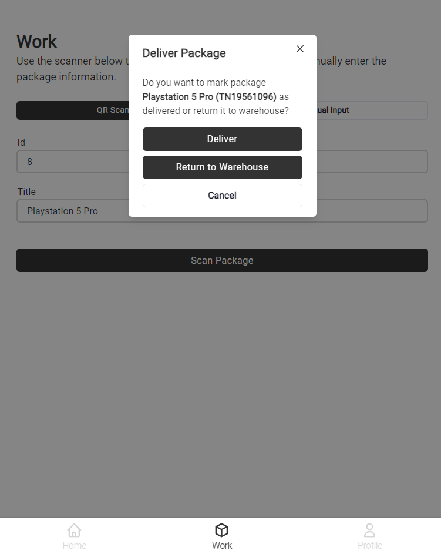

# Full Package Delivery Scenario

In this guide, we'll walk through a complete package delivery scenario, switching between the perspectives of the **courier** and the **end-user**/**customer** receiving the package.

We will proceed step-by-step through the process, manually entering package details instead of using the QR scan feature to accommodate devices without a camera.

## Table of Contents

- [Step 1 - Courier: Log in and Navigate to the Work Page](#step-1---courier-log-in-and-navigate-to-the-work-page)
- [Step 2 - Courier: Enter Package Information and "Scan" It](#step-2---courier-enter-package-information-and-scan-it)
- [Step 3 - Customer: View the Package Tracking Email and Track the Package](#step-3---customer-view-the-package-tracking-email-and-track-the-package)
- [Step 4 - Courier: Pick Up and Deliver the Package](#step-4---courier-pick-up-and-deliver-the-package)
- [Step 5 - Customer: Refresh the Tracking UI](#step-5---customer-refresh-the-tracking-ui)

## Flow

### Step 1 - Courier: Log in and Navigate to the Work Page

1. Open the Delivery UI at <a href="http://localhost:3001/work" target="_blank">http://localhost:3001/work</a>.
2. If you're not logged in, use the following credentials to authenticate:

   - Email: `john.doe@dp-demo.io`
   - Password: `Test123!`

### Step 2 - Courier: Enter Package Information and "Scan" It

1. On the work page, as the courier, enter the package information. You can use any number for the package ID and any title you prefer.

  

2. Click the `Scan Package` button. A popup will display the package information and available actions.

  

3. Click the `Register` button to add the package to the system. This will also:

   - Record the action on the Ethereum smart contract.
   - Send an email to the recipient.

### Step 3 - Customer: View the Package Tracking Email and Track the Package

1. Now, switching to the customer's perspective, open the "fake" email client at <a href="http://localhost:8025" target="_blank">http://localhost:8025</a>. You should see a new email notification about the package.

  

2. Click on the email message to view more details.

  

3. In the email, click the `Track Your Package` button. This will open the Tracking UI, where you can view real-time tracking information about the package.

  

### Step 4 - Courier: Pick Up and Deliver the Package

1. As the courier, click the `Scan Package` button again, using the same information entered in [Step 2](#step-2---courier-enter-package-information-and-scan-it), to pick up the package for delivery

  

2. Click the `Pickup` button to mark the package as picked up.
3. Click the `Scan Package` button a third time to proceed with delivery.

  

4. Click the `Deliver` button to confirm delivery to the customer. Alternatively, clicking `Return to Warehouse` will return the package to the warehouse, requiring a new pickup.

### Step 5 - Customer: Refresh the Tracking UI

1. As the customer, refresh the Tracking UI to see that your package has been successfully "delivered."

  

_Tip: The Tracking UI retrieves package information directly from the Ethereum Smart Contract. Feel free to explore the [code here](../../services/tracking-ui)._
