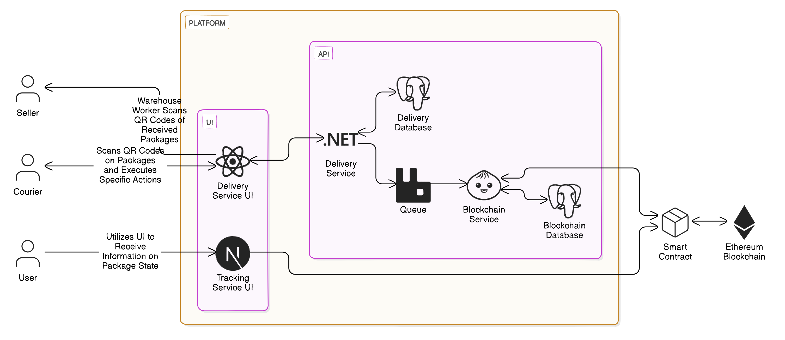

# Architecture & Technologies

### Architecture Diagram

### Technologies

- [React](https://react.dev/) - Utilized for the UI of the delivery service used by warehouse workers and couriers
- [NextJS](https://www.solidjs.com/) - Utilized for the UI of the tracking service, enabling users to track their deliveries
- [.NET](https://dotnet.microsoft.com/en-us/) - Employed for developing the public-facing API for the delivery service UI
- [Bun](https://bun.sh/) - Used for developing the blockchain service responsible for communicating with the delivery smart contract on the Ethereum blockchain
- [PostgreSQL](https://www.postgresql.org/) - A relational database used to store information required by the services, with each service having its own PostgreSQL database
- [RabbitMQ](https://www.rabbitmq.com/) - Provides a queue system that facilitates communication between the delivery and blockchain services
- [Solidity](https://soliditylang.org/) - The programming language used to write the delivery platform smart contract
- [Docker](https://www.docker.com/) - Used for developing services and running the entire system for demo purposes
