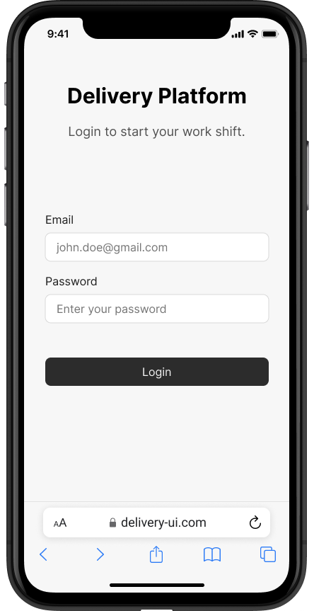

# Designs

## Delivery UI

### Login Page

This page allows warehouse workers and couriers to log into their accounts to access the delivery service.

### Home Page

The home page provides an overview of delivery platform demo functionalities and how to use it.

### Work Page

This page allows workers to scan QR codes on the packages with QR code scanner or manually input the information if camera is not available.
After information of the package has been submitted a modal is opened with different options that can be performed on the package (e.g. Pickup, Deliver, Return To Warehouse,..)

### Profile Page

This page allows users to view their profile information and log out of the service.

## Tracking UI

### Search Page

Users can find for their package using tracking number and secret passphrase received in their email.

### Package Information Page

This page provides detailed information about the status and location of a specific package.

## Common

### Not Found Page

Displayed when a user navigates to a non-existent page or an invalid URL.

