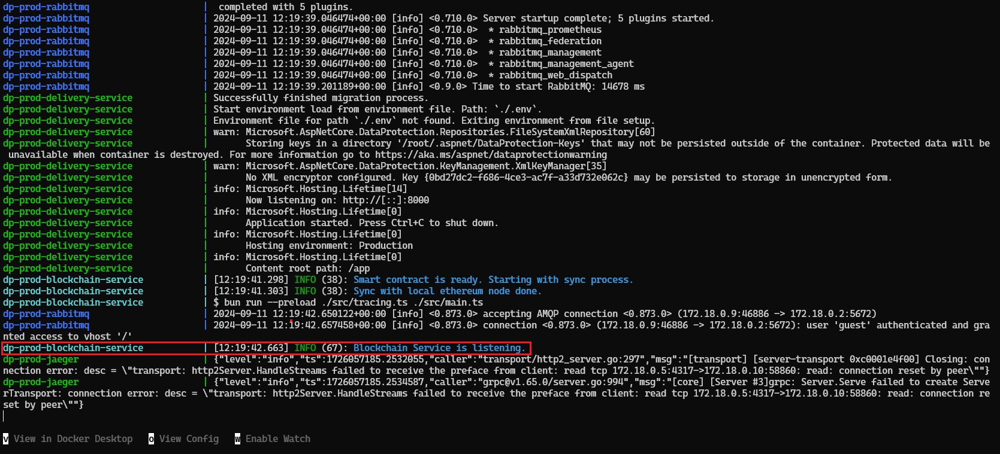

# How to Set Up Backend for Frontend Development

This document outlines the steps to set up all backend services to connect them with the frontend for easy frontend development. The setup process is designed to be as simple as possible, allowing developers to get started quickly.

## Prerequisites

The following tools are required to start the services:

- [Docker](https://www.docker.com/)
- [Git Bash](https://git-scm.com/) (Windows only)

## Setup & Run

### 1. Create an `.env` file

Create an `.env` file in the root of the project. For convenience, you can copy the values from the [.env.example](../../.env.example) file.

### 2. Start Backend Services

Run the following command to start all backend Docker services:

```bash
docker compose -f docker-compose-backend.yml up
```

> [!NOTE]
> Initial setup might take up to ~2 minutes. Some errors may appear during startup as services depend on each other and will restart until all are ready.

After a few minutes, your terminal should display output similar to the example below, indicating all services are running:



If you are unsure whether all services are started, wait a few more seconds. If nothing new appears in the terminal, the services are likely up and running.

### 3. Seed the Databases

Seed the databases by running the following commands for the first setup:

```bash
# Run the setup script
./scripts/startup/setup-project.sh --env dev
```

> [!NOTE]
> The setup script only needs to be run the first time you start the Docker compose. Subsequent runs will use the persisted data from previous sessions.

### 4. Access the Services

Your backend services are now up and running! You can access them at the following addresses:

- **Delivery Service API:**
  - Base URL: [http://localhost:8000](http://localhost:8000)
  - Swagger Documentation: [http://localhost:8000/swagger](http://localhost:8000/swagger)
- **Local Ethereum Node (JSON-RPC):**
  - Base URL: [http://localhost:8545/](http://localhost:8545/)
- **Mailpit UI:**
  - Interface URL: [http://localhost:8025](http://localhost:8025)
- **RabbitMQ Dashboard:**
  - Dashboard URL: [http://localhost:15672](http://localhost:15672) - _Hint: `Username: guest, Password: guest`_

### 5. Where to Next?

Open the [Swagger Documentation](http://localhost:8000/swagger) of the Delivery Service API and follow the example flow to create and update packages.
